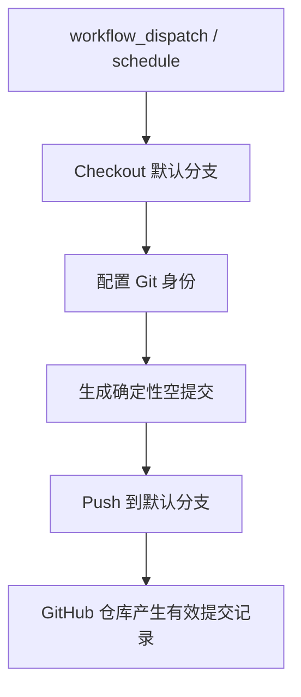

# 变更提案: auto-commit-fix

## 元信息
```yaml
类型: 修复/优化
方案类型: implementation
优先级: P1
状态: 待实施
创建: 2026-03-08
复杂度: simple
路由: R2
执行模式: DELEGATED
```

---

## 1. 需求

### 背景
当前仓库体量很小，核心交付点集中在 `.github/workflows/ci.yml`。现有 workflow 存在以下可靠性问题：

- 仅依赖 `schedule` 与 `push` 到 `master`，缺少 `workflow_dispatch`，不便于人工快速验证。
- 未显式声明 `permissions: contents: write`，在 GitHub Actions 默认只读权限下可能无法推送提交。
- 使用 `actions/checkout@v2`，版本较旧，且当前流程没有明确围绕默认分支执行。
- 存在 `Random Execute` 随机失败步骤，会直接破坏自动提交成功率。
- 提交信息依赖外部 `https://v1.hitokoto.cn` 接口，增加了额外的网络波动风险。

### 目标
修复并增强自动提交 workflow 的可靠性，使仓库能够在 GitHub Actions 中稳定地向默认分支生成并推送有效空提交，从而形成连续、可审计的提交记录。

### 约束条件
```yaml
时间约束: 以最小改动完成修复，优先只调整 workflow 文件
性能约束: 单次运行应在 GitHub Hosted Runner 常规时限内稳定完成
兼容性约束: 兼容 GitHub 官方 Ubuntu runner 与默认 GITHUB_TOKEN 认证模型
业务约束: 不改动业务代码；提交目标必须是仓库默认分支；避免引入新的高波动外部依赖
```

### 验收标准
- [ ] workflow 明确声明 `permissions: contents: write`
- [ ] workflow 支持 `workflow_dispatch` 手动触发
- [ ] `schedule` 改为错峰触发，避免整点高峰调度拥堵
- [ ] 移除随机失败步骤与外部文案依赖，runner 可稳定生成空提交
- [ ] 提交流程显式面向默认分支，成功后仓库出现有效提交记录

---

## 2. 方案

### 技术方案
本次修复聚焦于 `.github/workflows/ci.yml`，通过一次性解决“触发器、权限、分支目标、提交稳定性”四类问题来提升自动提交成功率：

- 触发策略调整为 `workflow_dispatch + schedule`，保留人工验证入口，并将定时任务改为非整点时间。
- 在 workflow 顶层增加 `permissions: contents: write`，确保 `GITHUB_TOKEN` 具备向仓库写入提交的最低必要权限。
- 将 `actions/checkout` 升级到稳定版本，并围绕仓库默认分支进行 checkout 与 push，避免继续硬编码 `master`。
- 删除 `Random Execute` 与外部 `curl` 文案获取逻辑，改为使用时间戳或固定格式生成提交信息，降低随机和外部网络故障。
- 保留 `git commit --allow-empty` 路径，通过空提交稳定制造提交记录，并在日志中输出关键步骤，方便定位异常。

### 影响范围
```yaml
涉及模块:
  - .github/workflows/ci.yml: 调整触发器、权限、checkout、提交与推送逻辑
  - .helloagents/plan/202603082244_auto-commit-fix/proposal.md: 记录方案设计与技术决策
  - .helloagents/plan/202603082244_auto-commit-fix/tasks.md: 记录实施任务与进度状态
预计变更文件: 3
```

### 风险评估
| 风险 | 等级 | 应对 |
|------|------|------|
| 仓库未开启 GitHub Actions 写权限，导致 push 仍被拒绝 | 中 | 在 workflow 中显式声明 `contents: write`，并在验证阶段确认仓库 Actions 权限设置 |
| 默认分支与历史硬编码 `master` 不一致，导致 checkout 或 push 目标错误 | 中 | 使用 `github.event.repository.default_branch` 统一默认分支来源，并在手动触发时验证 |
| GitHub `schedule` 本身存在延迟，影响自动提交时点 | 低 | 采用错峰 cron 并保留 `workflow_dispatch` 作为补充验证入口 |
| runner 外部网络波动导致流程不稳定 | 低 | 移除外部文案接口依赖，提交信息改为本地可生成内容 |

---

## 3. 技术设计

### 架构设计


### API设计
本方案不涉及对外 API 变更。

### 数据模型
本方案不涉及数据模型变更。

---

## 4. 核心场景

### 场景: 定时或手动触发自动空提交
**模块**: GitHub Actions workflow
**条件**: 到达定时窗口或由维护者手动触发，且仓库允许 Actions 写入内容
**行为**: runner checkout 默认分支，配置 Git 用户信息，生成空提交并推送回默认分支
**结果**: 默认分支新增有效提交记录，workflow 运行成功并可在 Actions 页面追踪日志

---

## 5. 技术决策

### auto-commit-fix#D001: 取消随机失败与外部文案依赖，改用确定性空提交流程
**日期**: 2026-03-08
**状态**: ✅采纳
**背景**: 当前 workflow 依赖 `Random Execute` 与外部文案接口，任何随机失败或网络异常都会直接降低自动提交成功率，与“稳定产出提交记录”的目标冲突。
**选项分析**:
| 选项 | 优点 | 缺点 |
|------|------|------|
| A: 保留随机失败和外部文案接口 | 提交信息更具变化性，保留现有流程 | 成功率不可控，受随机数和外部网络双重影响 |
| B: 使用本地可生成的确定性提交信息并保留空提交 | 失败面更少，便于诊断，满足稳定提交目标 | 提交信息样式相对简单 |
**决策**: 选择方案 B
**理由**: 本任务的核心目标是“稳定自动提交”，优先级高于提交文案的随机性与趣味性；确定性方案更利于 runner 稳定执行与故障定位。
**影响**: 影响 `.github/workflows/ci.yml` 中提交消息生成逻辑与失败路径设计。

### auto-commit-fix#D002: 触发策略以 `workflow_dispatch + schedule` 为主，提交目标动态跟随默认分支
**日期**: 2026-03-08
**状态**: ✅采纳
**背景**: 当前 workflow 将 `push` 事件绑定到 `master`，既不利于兼容默认分支差异，也无法满足快速手动验证的需要。
**选项分析**:
| 选项 | 优点 | 缺点 |
|------|------|------|
| A: 继续依赖 `push(master) + schedule` | 改动较少 | 默认分支不一致时易失效，手动验证能力不足 |
| B: 改为 `workflow_dispatch + 错峰 schedule`，默认分支动态解析 | 更贴合目标，验证入口清晰，分支兼容性更好 | 需要同时调整触发器与 push 逻辑 |
**决策**: 选择方案 B
**理由**: 自动提交的主链路是“定时执行 + 可手动验证”，使用默认分支动态解析可避免将实现绑定到历史分支命名。
**影响**: 影响 workflow 触发器配置、默认分支 checkout 与 push 目标设置。
